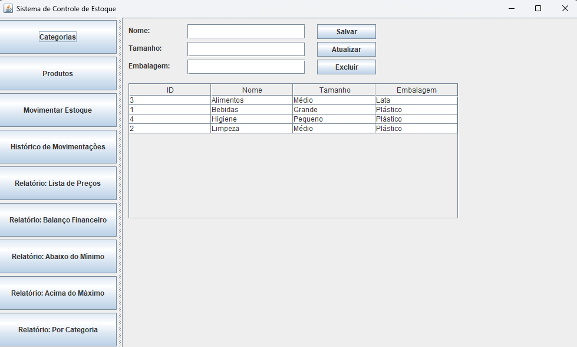
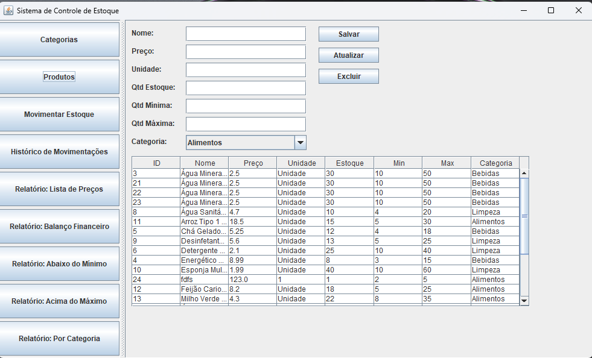

# 📦 Sistema de Controle de Estoque

## 👨‍💻 Integrantes do Projeto
- DOUGLAS PIERRI BECCARI – RA: 10725117809
- JOÃO VITOR CARDOSO DE JESUS – RA: 10724266837
- KAIKE AUGUSTO DIAS DOS SANTOS – RA: 10725113309
- MARCOS ANTONIO GASPERIN – RA: 10724265643
- MATHEUS CARDOSO MARTINS – RA: 10725120472

## 📝 Descrição do Projeto
Este projeto tem como objetivo criar um sistema de controle de estoque utilizando Java, Swing e MySQL. O sistema permite o cadastro de categorias, produtos, movimentações de entrada e saída, além da geração de relatórios.

Foi desenvolvido como atividade prática da disciplina **Programação de Soluções Computacionais**, da Universidade do Sul de Santa Catarina – UNISUL.

## 🚀 Funcionalidades Principais
- ✅ Cadastro de Categorias (CRUD)
- ✅ Cadastro de Produtos (CRUD)
- ✅ Controle de Movimentações (Entrada e Saída)
- ✅ Histórico de Movimentações
- ✅ Relatórios:
  - Lista de preços
  - Balanço físico e financeiro
  - Produtos abaixo do mínimo
  - Produtos acima do máximo
  - Quantidade de produtos por categoria

## 🔧 Tecnologias Utilizadas
| Tecnologia | Versão |
|-------------|--------|
| Java        | 13     |
| NetBeans    | 13     |
| MySQL       | 8.0+   |
| Swing (Java)| -      |
| Git/GitHub  | -      |

## 📜 Requisitos Funcionais
- RF01 – O sistema deve permitir o cadastro de categorias.
- RF02 – O sistema deve permitir o cadastro de produtos.
- RF03 – O sistema deve permitir controlar entradas e saídas de produtos.
- RF04 – O sistema deve gerar relatórios conforme a necessidade do usuário.
- RF05 – O sistema deve exibir um histórico de movimentações.

## 🚫 Requisitos Não Funcionais
- RNF01 – O sistema deve ser desenvolvido na linguagem Java.
- RNF02 – O banco de dados utilizado deve ser MySQL.
- RNF03 – A interface deve ser desktop, utilizando Swing.
- RNF04 – O sistema deve ter fácil usabilidade e ser leve.
- RNF05 – O controle de versão deve ser feito no GitHub.

## 🖥️ Telas do Sistema

### 🔸 Cadastro de Categorias

### 🔸 Cadastro de Produtos

### 🔸 Movimentação de Estoque

### 🔸 Histórico de Movimentações

## 📊 Relatórios Gerados

### 📑 Lista de Preços

### 📑 Balanço Financeiro

### 📑 Produtos Abaixo do Mínimo

### 📑 Produtos Acima do Máximo

### 📑 Produtos por Categoria

## 📚 Fontes
- UNISUL – Manual de Metodologia Acadêmica.
- Documentação Java (https://docs.oracle.com)
- Documentação MySQL (https://dev.mysql.com)
- GitHub – Repositório base do projeto: https://github.com/osmarbraz/CadastroAlunoMySQLDAO

## 🧾 Licença
Este projeto é acadêmico, sem fins lucrativos, desenvolvido apenas para fins de aprendizagem na disciplina **Programação de Soluções Computacionais – UNISUL**.

## 🔗 Link do Projeto no GitHub
👉 [https://github.com/bulinrutss/A3-Solucoes-Computacionais](https://github.com/bulinrutss/A3-Solucoes-Computacionais)
